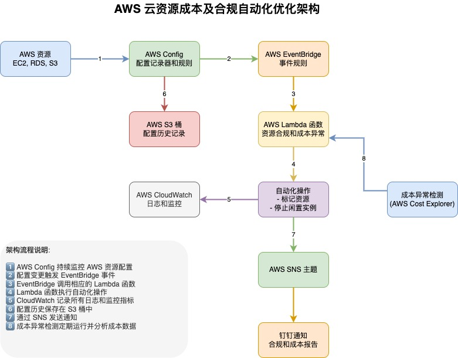

# AWS 云资源成本及合规自动化优化方案

本项目提供一套基于 Terraform 的 AWS 成本优化自动化解决方案，通过 AWS Config、EventBridge 和 Lambda 函数实现资源监控、合规检查和成本异常检测，并通过钉钉实时通知。

## 目录

- [功能特性](#功能特性)
- [架构概述](#架构概述)
- [AWS 服务说明](#aws-服务说明)
- [代码工程结构](#代码工程结构)
- [部署指南](#部署指南)
  - [前提条件](#前提条件)
  - [配置说明](#配置说明)
  - [部署步骤](#部署步骤)
  - [验证部署](#验证部署)
- [使用指南](#使用指南)
  - [成本异常监控](#成本异常监控)
  - [资源合规管理](#资源合规管理)
  - [钉钉通知设置](#钉钉通知设置)
- [自定义配置](#自定义配置)
- [注意事项](#注意事项)
- [故障排除](#故障排除)

## 功能特性

1. **资源合规监控**
   - 检测未标记的资源（EC2、S3、RDS 等）
   - 检测闲置的 EC2 实例
   - 监控安全组开放端口
   - 实时监控新创建或状态变更的资源

2. **自动化操作**
   - 自动为不合规资源添加标签
   - 自动停止闲置的 EC2 实例
   - 发送实时通知到钉钉

3. **成本异常检测**
   - 每日自动分析 AWS 成本数据
   - 检测成本异常（超过过去 7 天平均值的设定阈值）
   - 发送详细异常报告并提供处理建议

## 架构概述

本解决方案采用无服务器架构，主要由以下组件构成：



1. **AWS Config**：负责持续监控和记录 AWS 资源配置变更，检测不合规的资源
2. **AWS EventBridge**：处理各类事件触发器，如 Config 规则变更、EC2 状态变更
3. **AWS Lambda**：提供自动化处理逻辑，包括资源合规处理和成本异常检测
4. **AWS SNS**：用于消息通知路由
5. **钉钉通知**：通过自定义的钉钉机器人发送通知和警报

整个解决方案通过 Terraform 实现基础设施即代码（IaC），便于版本控制和持续部署。

## AWS 服务说明

本解决方案使用了以下 AWS 服务：

1. **[AWS Config](https://aws.amazon.com/config/)** - 提供 AWS 资源清单、配置历史和配置变更通知的服务，使您能够进行合规性审核、安全性分析、资源变更跟踪和故障排除。

2. **[AWS EventBridge](https://aws.amazon.com/eventbridge/)** - 无服务器事件总线服务，使应用程序能够轻松地从各种来源接收事件数据并响应这些事件。在本解决方案中用于处理 Config 规则变更和 EC2 状态变更事件。

3. **[AWS Lambda](https://aws.amazon.com/lambda/)** - 无服务器计算服务，允许您运行代码而无需配置或管理服务器。在本解决方案中用于执行资源合规处理和成本异常检测逻辑。

4. **[AWS SNS (Simple Notification Service)](https://aws.amazon.com/sns/)** - 高度可用、持久、安全、完全托管的发布/订阅消息收发服务，支持分离微服务、分布式系统和无服务器应用程序。在本解决方案中用于通知路由。

5. **[AWS Cost Explorer](https://aws.amazon.com/aws-cost-management/aws-cost-explorer/)** - 提供了查看和分析 AWS 成本和使用情况的界面，本解决方案通过 API 调用获取成本数据进行异常检测。

6. **[Amazon S3 (Simple Storage Service)](https://aws.amazon.com/s3/)** - 提供行业领先的可扩展性、数据可用性、安全性和性能的对象存储服务，在本解决方案中用于存储 AWS Config 配置历史和 Terraform 状态文件。

7. **[AWS IAM (Identity and Access Management)](https://aws.amazon.com/iam/)** - 安全管理 AWS 服务和资源访问的服务，本解决方案使用 IAM 角色和策略确保 Lambda 函数的最小权限原则。

8. **[Amazon CloudWatch](https://aws.amazon.com/cloudwatch/)** - 监控和可观测性服务，在本解决方案中用于 Lambda 函数的日志记录和故障排除。

9. **[Amazon EC2 (Elastic Compute Cloud)](https://aws.amazon.com/ec2/)** - 在云中提供可调计算容量的服务，是本解决方案监控和优化的主要资源之一。

10. **[Amazon RDS (Relational Database Service)](https://aws.amazon.com/rds/)** - 使在云中更轻松地设置、操作和扩展关系数据库的服务，也是本解决方案监控和优化的资源之一。

## 代码工程结构

```
aws-cost-optimization/
├── main.tf                    # 主 Terraform 配置文件
├── variables.tf               # 变量定义文件
├── outputs.tf                 # 输出定义文件
├── terraform.tfvars.example   # 示例变量值文件
├── modules/                   # Terraform 模块目录
│   ├── config/                # AWS Config 相关配置
│   │   ├── main.tf            # Config 规则和记录器配置
│   │   ├── variables.tf       # Config 模块变量
│   │   └── outputs.tf         # Config 模块输出
│   ├── lambda/                # Lambda 函数模块
│   │   ├── main.tf            # Lambda 函数和 IAM 角色配置
│   │   ├── variables.tf       # Lambda 模块变量
│   │   └── outputs.tf         # Lambda 模块输出
│   └── eventbridge/           # EventBridge 事件规则
│       ├── main.tf            # 事件规则配置
│       ├── variables.tf       # EventBridge 模块变量
│       └── outputs.tf         # EventBridge 模块输出
└── lambda/                    # Lambda 函数源码
    ├── resource_compliance/   # 资源合规检查函数
    │   ├── __init__.py        # 模块初始化文件
    │   └── index.py           # 主函数代码
    ├── cost_anomaly/          # 成本异常检测函数
    │   ├── __init__.py        # 模块初始化文件
    │   └── index.py           # 主函数代码
    └── utils/                 # 共享工具函数
        ├── __init__.py        # 模块初始化文件
        └── dingtalk.py        # 钉钉通知客户端
```

### 主要文件说明

1. **Terraform 配置**
   - `main.tf`: 主配置文件，引用各个模块
   - `variables.tf`: 定义配置变量，如 AWS 区域、环境名称、钉钉 Webhook 等
   - `outputs.tf`: 定义部署输出，如 Lambda ARN、Config 规则等
   - `terraform.tfvars.example`: 示例变量值，需复制为 `terraform.tfvars` 并填写

2. **模块配置**
   - `modules/config/`: 配置 AWS Config 记录器、传输通道和规则
   - `modules/lambda/`: 配置 Lambda 函数、IAM 角色和触发器
   - `modules/eventbridge/`: 配置事件规则和目标

3. **Lambda 函数**
   - `lambda/resource_compliance/`: 处理资源合规性的函数
   - `lambda/cost_anomaly/`: 成本异常检测函数
   - `lambda/utils/dingtalk.py`: 钉钉通知工具类

## 部署指南

### 前提条件

1. **AWS 账户**
   - 有足够权限创建和管理 AWS 资源的 IAM 用户或角色
   - 确保 AWS CLI 已配置正确的访问凭证

2. **Terraform 环境**
   - 安装 Terraform (>= 1.0.0)
   - 如使用远程状态，需准备 S3 存储桶存储状态文件

3. **钉钉机器人**
   - 创建钉钉群组和自定义机器人
   - 获取机器人的 Webhook URL 和安全密钥（Secret）

4. **AWS 服务启用**
   - 确保已启用 AWS Config 服务
   - 确保已启用 AWS Cost Explorer API

### 配置说明

1. **创建配置文件**

   将示例配置文件复制为实际配置文件：
   ```bash
   cp terraform.tfvars.example terraform.tfvars
   ```

2. **编辑配置文件**

   编辑 `terraform.tfvars` 文件，填写必要的配置参数：
   ```hcl
   # AWS 区域
   aws_region = "ap-northeast-1"  # 使用您的 AWS 区域，如：东京区域

   # 环境名称
   environment = "prod"  # 如 dev, test, prod

   # 钉钉机器人配置
   dingtalk_webhook = "https://oapi.dingtalk.com/robot/send?access_token=your_access_token"
   dingtalk_secret = "your_dingtalk_secret"

   # 成本异常阈值百分比
   threshold_percentage = 15  # 根据需要调整，默认为 10%

   # 需要监控的资源类型
   resources_to_monitor = [
     "AWS::EC2::Instance",
     "AWS::S3::Bucket",
     "AWS::RDS::DBInstance",
     "AWS::EC2::SecurityGroup"
   ]
   ```

3. **自定义 S3 后端配置**

   如果使用 S3 存储 Terraform 状态，编辑 `main.tf` 文件中的 backend 配置：
   ```hcl
   backend "s3" {
     bucket = "your-terraform-state-bucket"  # 替换为您的 S3 桶名称
     key    = "aws-cost-optimization/terraform.tfstate"
     region = "ap-northeast-1"  # 替换为您的区域
   }
   ```

### 部署步骤

1. **初始化 Terraform**

   ```bash
   terraform init
   ```

2. **验证配置**

   ```bash
   terraform validate
   ```

3. **预览部署计划**

   ```bash
   terraform plan
   ```

4. **执行部署**

   ```bash
   terraform apply
   ```
   
   确认部署计划后输入 `yes` 进行部署。

5. **查看输出**

   部署完成后，Terraform 将输出以下资源的 ARN 和名称：
   - Lambda 函数 ARN
   - Config 规则列表
   - EventBridge 规则列表

### 验证部署

1. **检查 AWS Config 控制台**
   - 登录 AWS 控制台，进入 Config 服务
   - 确认 Config 记录器已启用
   - 查看已创建的 Config 规则

2. **检查 Lambda 函数**
   - 进入 Lambda 控制台
   - 确认两个 Lambda 函数已创建并启用
   - 查看权限和环境变量配置

3. **测试钉钉通知**
   - 手动触发 Lambda 函数进行测试
   - 检查钉钉群组是否收到通知

## 使用指南

### 成本异常监控

成本异常监控将按照以下流程自动运行：

1. **数据收集**：每天自动从 AWS Cost Explorer 获取最新的成本数据
2. **数据分析**：与过去 7 天的平均值对比，检测异常增长
3. **异常通知**：当检测到成本异常时，自动发送详细报告到钉钉

成本异常通知包含以下信息：
- 异常服务名称
- 昨日成本
- 周平均成本
- 增长率
- 处理建议

### 资源合规管理

资源合规管理包括以下自动化流程：

1. **标签合规**
   - 系统检测未标记或标记不完整的资源
   - 自动添加必要标签（AutoTagged, TaggedOn, RequiresReview）
   - 发送通知到钉钉，提示资源已标记

2. **EC2 闲置实例管理**
   - 检测长时间低利用率的 EC2 实例
   - 自动停止闲置实例
   - 发送通知到钉钉，包含实例信息和操作结果

3. **安全组合规**
   - 检测存在安全风险的安全组配置
   - 发送详细通知，要求手动审核和修复

### 钉钉通知设置

钉钉通知模块采用安全签名方式，确保通信安全：

1. **通知类型**
   - Markdown 格式通知：用于详细的异常和合规报告
   - 文本格式通知：用于简单的系统状态和错误报告

2. **通知权限**
   - 默认不会 @所有人，除非是严重警报
   - 可以在配置中指定需要 @的人员手机号

3. **通知频率控制**
   - 成本异常：每日一次（可配置）
   - 资源合规：实时通知，但可合并同类事件

4. **钉钉机器人配置**
   - Webhook地址格式：`https://oapi.dingtalk.com/robot/send?access_token=your_access_token`
   - 安全设置：使用加签方式（secret），在Lambda中自动计算签名
   - API文档参考：[钉钉开放平台-自定义机器人](https://open.dingtalk.com/document/robots/custom-robot-access)
   - [机器人消息类型及数据格式](https://open.dingtalk.com/document/robots/message-types-and-data-format)

解决方案中的Lambda函数已包含钉钉消息签名计算和发送实现，参见 `lambda/utils/dingtalk.py`。

## 自定义配置

系统提供多种自定义选项，可通过修改 `terraform.tfvars` 实现：

1. **监控阈值调整**
   - `threshold_percentage`：成本异常阈值百分比（默认 10%）

2. **资源监控范围**
   - `resources_to_monitor`：指定需要监控的资源类型列表

3. **通知设置**
   - 可修改钉钉 Webhook 和 Secret
   - 可配置通知频率和格式

4. **Lambda 函数配置**
   - 内存和超时设置可在 Lambda 模块中调整
   - 执行频率可通过 EventBridge 规则调整

## 注意事项

1. **服务成本**
   - AWS Config 服务会产生费用，按记录的配置项数量计费
   - Cost Explorer API 调用也会产生费用
   - Lambda 函数执行、EventBridge 规则和 SNS 消息也有相应费用

2. **权限考量**
   - 部署过程需要较高的 IAM 权限
   - Lambda 执行角色仅包含必要的最小权限

3. **数据延迟**
   - AWS Config 扫描资源可能有延迟（数分钟到数小时）
   - Cost Explorer 数据通常有 24 小时延迟

4. **自定义规则限制**
   - AWS Config 内置规则有一定限制，如需高级检测逻辑，可能需要开发自定义规则

## 故障排除

1. **部署失败**
   - 检查 IAM 权限是否足够
   - 确认所有必要的服务都已在区域中启用
   - 验证 S3 存储桶权限（如使用远程状态）

2. **Lambda 执行错误**
   - 检查 CloudWatch Logs 查看详细错误信息
   - 确认环境变量配置正确
   - 验证 IAM 角色权限是否足够

3. **钉钉通知失败**
   - 验证 Webhook URL 和 Secret 是否正确
   - 检查网络连接是否正常
   - 查看 Lambda 日志中的详细错误信息

4. **合规检查不触发**
   - 确认 AWS Config 记录器状态为启用
   - 检查 EventBridge 规则配置
   - 验证资源类型是否在监控范围内
