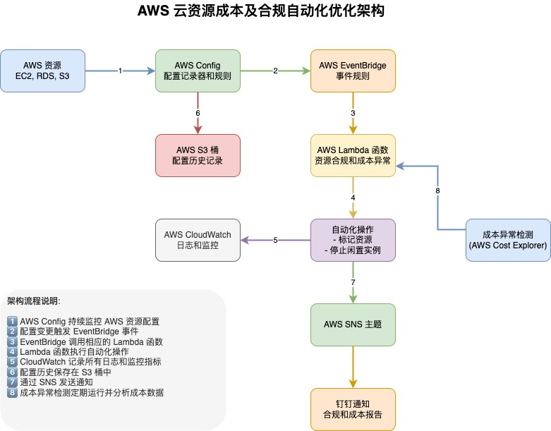

# AWS 云资源成本及合规自动化优化方案

本项目提供一套基于 Terraform 的 AWS 成本优化自动化解决方案，通过 AWS Config、EventBridge 和 Lambda 函数实现资源监控、合规检查和成本异常检测，并通过钉钉实时通知。

详细文档请查阅 [AWS_COST_OPTIMIZATION.md](./AWS_COST_OPTIMIZATION.md)

## 架构概览

## 主要功能

- 资源合规监控（未标记资源、闲置实例、安全组配置）
- 自动化操作（自动标记、停止闲置实例）
- 成本异常检测和通知
- 钉钉集成通知 