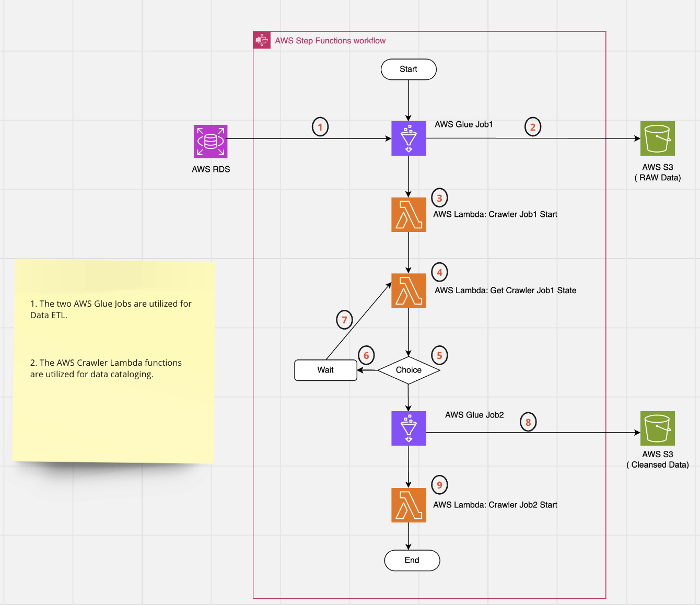

# Data ETL Pipeline 
The task is to construct a Data ETL Pipeline utilizing AWS Glue and AWS Step Functions.

The architecture of the pipeline is illustrated below:

## Background

- The mastery of the technical stack depicted in the figure below is imperative for aspiring Data Engineers aiming to excel in their field：

- Meanwhile,the process of Extract, Transform, Load (ETL) or Extract, Load, Transform (ELT) plays a crucial role in the Data Stack architecture for achieving effective data integration:

- Hence, this guide provides reference example for the implementation of an end-to-end ETL Pipeline using AWS Stepfunctions in conjunction with AWS Glue.
