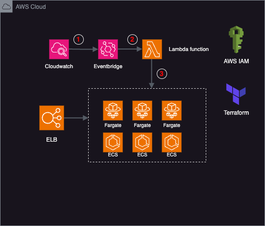

### ECS Task Scheduling: Effective Strategy to Reduce Costs

#### Introduction

- The Amazon Elastic Container Service (Amazon ECS) is a highly scalable and high-performance container orchestration service that supports Docker containers, facilitating the seamless execution and scalability of containerized applications. By leveraging Fargate, Amazon ECS enables effortless container management without the need for infrastructure maintenance.
- In order to minimize the expenses associated with utilizing ECS,we developed a system using Lambda and EventBridge to stop ECS tasks outside of business hours

#### Architecture
The architecture of the strategy is illustrated below:

#### Usage
- The integration with EventBridge allows for scheduled execution, making Lambda an ideal environment for stopping and starting ECS tasks.

#### How to use deploy architecture with Terraform

- terraform init
- terraform plan -var-file="myvariables.tfvars" # specify your .tfvars files tailored to specific environment
- terraform apply -var-file="myvariables.tfvars" # specify your .tfvars files tailored to specific environment
- terraform destroy -var-file="myvariables.tfvars" # specify your .tfvars files tailored to specific environment