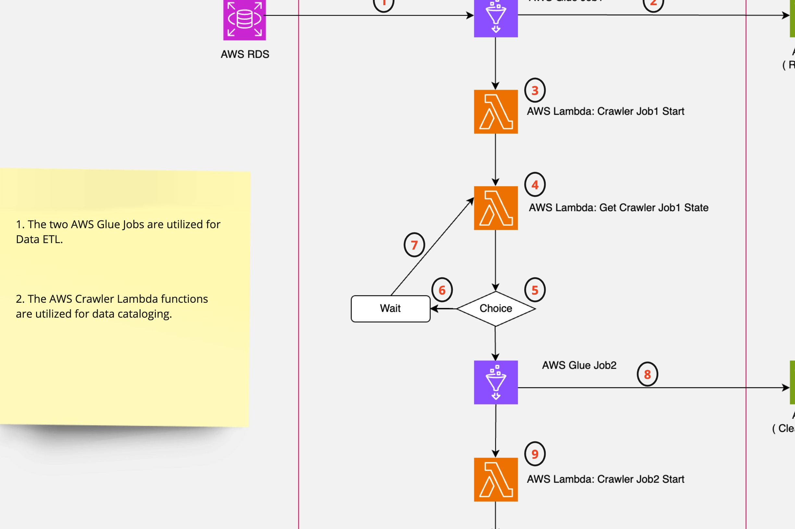

# Data ETL Pipeline 
The task is to construct a Data ETL Pipeline utilizing AWS Glue and AWS Step Functions.

The architecture of the pipeline is illustrated below:

## Background

- The mastery of the technical stack depicted in the figure below is imperative for aspiring Data Engineers aiming to excel in their field：

