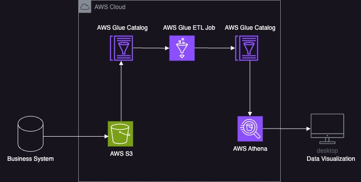

### 背景
___

- 在当前数据驱动的环境中，XML文件的分析对于不同行业（如金融、医疗保健和政府）具有重要意义。利用XML数据可以帮助组织获取有价值的见解，提升决策过程，并简化数据集成工作。然而，由于XML文件具有<u>**半结构化**</u>和<u>**高度嵌套性**</u>，在处理大型和复杂模式时会面临访问和分析信息的挑战。
- 本方案深入研究如何使用**Amazon Athena**以表格格式读取XML文件，并利用**AWS Glue**进行编目、分类和基于parquet的处理。本方案提供在AWS环境中高效处理XML数据的实践参考，从而实现无缝查询和分析使用Athena。
### 前提条件
- AWS云平台账号
- 熟悉对应的AWS云产品
- 熟悉Spark、Python和SQL

___

### 方案架构

___

### 方案实施
- 前置准备
  -  XML文件上传到**AWS S3 Bucket**
  -  配置所有必须的**IAM roles**和**IAM policies**
  -  使用**AWS Glue**创建云数据库,[参考文档](https://docs.aws.amazon.com/glue/latest/dg/start-data-catalog.html)
  
- 处理XML文件的步骤
  - 在开始创建**Glue crawler**之前，需要先建立一个**XML classifier**，并在其中定义**Row tag**,[参考文档](https://docs.aws.amazon.com/glue/latest/dg/custom-classifier.html)

  - 使用**AWS Glue**创建一个**Glue crawler** ，从XML文件中提取**metadata**，并在**AWS Glue**数据目录中执行<u>**crawler**</u>以生成一张<u>**data table**</u>,[参考文档](https://docs.aws.amazon.com/glue/latest/dg/define-crawler.html)

---
  - 由于**AWS Athena**不支持**XML format**，因此需要利用**AWS Glue job**将**XML format**转换为**Parquet format**;这项操作既可以在<u>**AWS Glue控制台图形化界面**</u>完成，也可以通过<u>**脚本**</u>完成
    - **脚本**方式：
      - 在**AWS Glue**选择**ETL Jobs -> Visual ETL -> Script editor**
      - 编写<u>**[代码](src/job.py)**</u>并且运行**job**
      - 使用**AWS Glue**创建一个**Glue crawler**，用于提取**Parquet元数据**并在**AWS Glue**数据目录中生成数据表（选择之前创建的**XML classifier**)

      - 在**AWS Athena**中进行表格查询，返回结果将以JSON格式呈现

### 总结

---
本方案实践了使用**AWSAthena**读取XML文件的过程，并将表结构扁平化以便于进一步分析，这种方法使用户能够在进行进一步处理之前验证源数据。

### 其他实践参考

---
来自**西云科技**官方技术公众号的[使用AWS Athena和AWS S3构建低成本高性能可扩展的日志分析平台](https://mp.weixin.qq.com/s/2Fm6g-SDZpuTM9jr7_Yf5A)是一篇基于云原生技术构建企业生产使用的低成本可扩展日志分析平台的很好参考方案实践。

